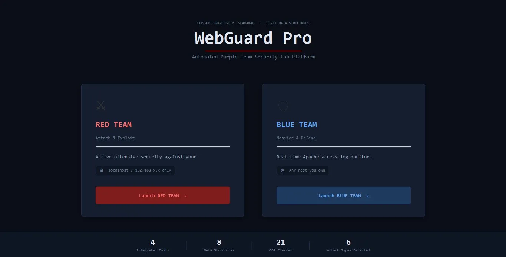
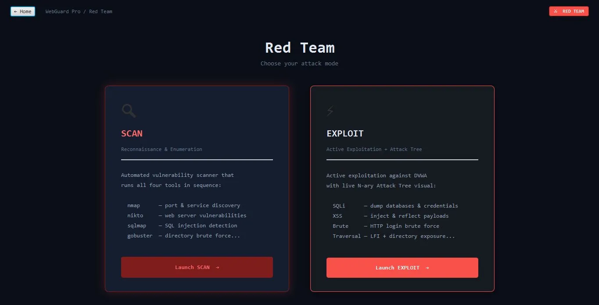
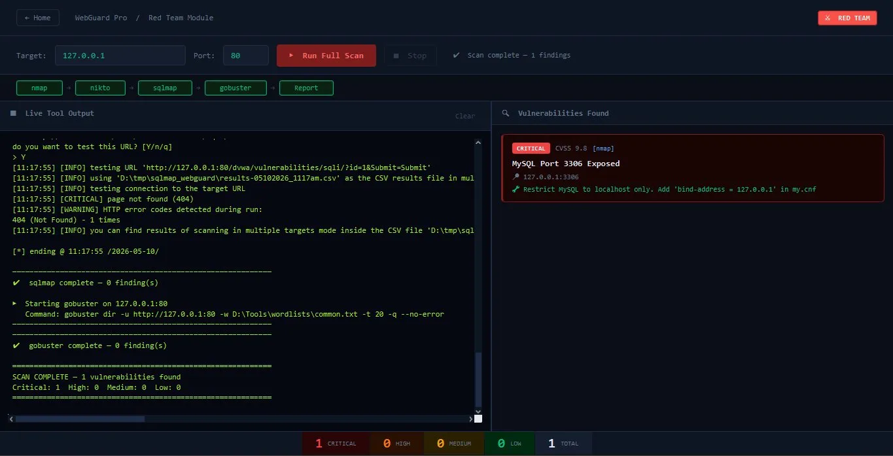
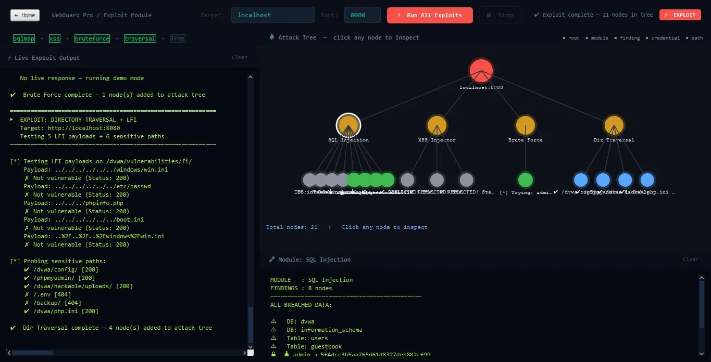
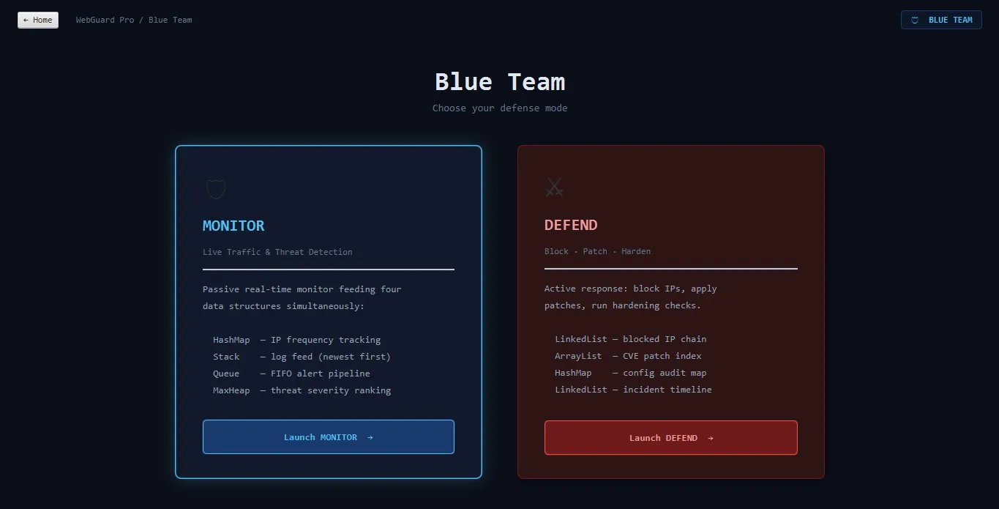
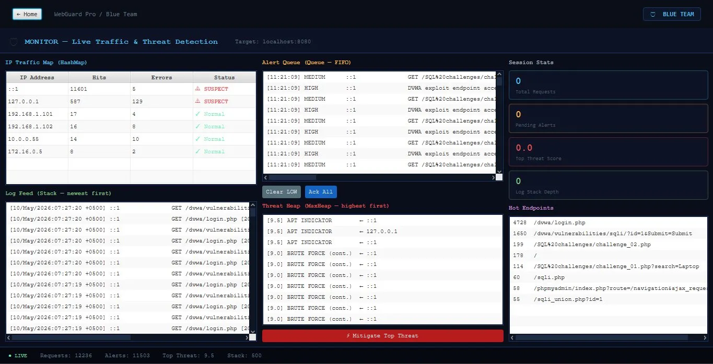
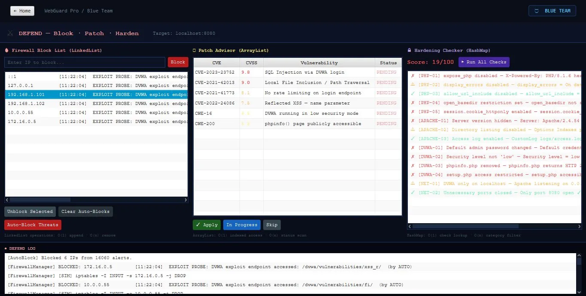

<div align="center">


<br/><br/>

```
██╗    ██╗███████╗██████╗  ██████╗ ██╗   ██╗ █████╗ ██████╗ ██████╗     ██████╗ ██████╗  ██████╗
██║    ██║██╔════╝██╔══██╗██╔════╝ ██║   ██║██╔══██╗██╔══██╗██╔══██╗    ██╔══██╗██╔══██╗██╔═══██╗
██║ █╗ ██║█████╗  ██████╔╝██║  ███╗██║   ██║███████║██████╔╝██║  ██║    ██████╔╝██████╔╝██║   ██║
██║███╗██║██╔══╝  ██╔══██╗██║   ██║██║   ██║██╔══██║██╔══██╗██║  ██║    ██╔═══╝ ██╔══██╗██║   ██║
╚███╔███╔╝███████╗██████╔╝╚██████╔╝╚██████╔╝██║  ██║██║  ██║██████╔╝    ██║     ██║  ██║╚██████╔╝
 ╚══╝╚══╝ ╚══════╝╚═════╝  ╚═════╝  ╚═════╝ ╚═╝  ╚═╝╚═╝  ╚═╝╚═════╝     ╚═╝     ╚═╝  ╚═╝ ╚═════╝
```

# WebGuard Pro
### Automated Purple Team Security Lab Platform

**A dual-mode cybersecurity desktop application that simulates real-world Red Team attacks and Blue Team defenses against DVWA — built with Java 17, JavaFX 21, and 8 core data structures.**

<br/>
🎓 CSC211 — Data Structures | COMSATS University Islamabad
👨‍💻 Muhammad Zakria
🧑‍🏫 Supervised by: Ms. Najla Raza

<br/>
[](https://github.com/Md-zakria)
[](https://linkedin.com/in/muhammad-zakria-9914a0325)
[](https://tryhackme.com/p/ZAKxOB)
</div>

---

## 📸 Screenshots

### 🏠 Home Screen — Purple Team Launch Pad

> Choose between Red Team (offensive) and Blue Team (defensive) modes. Stats bar shows 4 integrated tools, 8 data structures, 21 OOP classes, and 6 attack types detected.

---

### 🔴 Red Team Hub — Attack Mode Selection

> Select between **SCAN** (reconnaissance & enumeration) and **EXPLOIT** (active exploitation with live Attack Tree visualization).

---

### 🔍 Red Team Scan — Live Vulnerability Scanner

> All four tools run sequentially in a live terminal panel. Results are ranked by CVSS score using a MinHeap and deduplicated with a HashMap. Shown: **CRITICAL — MySQL Port 3306 Exposed (CVSS 9.8)**.

---

### ⚡ Red Team Exploit — N-ary Attack Tree

> Four exploit modules run against DVWA and build a live **N-ary Attack Tree** on a JavaFX canvas. Click any node to inspect breached data — databases, tables, credentials, and path disclosures all visualized in real time.

---

### 🔵 Blue Team Hub — Defense Mode Selection

> Select between **MONITOR** (passive real-time traffic & threat detection) and **DEFEND** (active response: block, patch, harden).

---

### 📡 Blue Team Monitor — Live Threat Detection Dashboard

> Four live panels powered by four different data structures simultaneously — IP traffic table (HashMap), log feed (Stack), alert queue (Queue/FIFO), and threat heap (MaxHeap). Bottom status bar: **12,236 requests · 11,503 alerts · Top Threat: 9.5**.

---

### 🛡️ Blue Team Defend — Firewall, Patch & Harden

> Three defense panels: **Firewall Block List** (LinkedList), **Patch Advisor** with 6 CVE mappings (ArrayList), and **Hardening Checker** scoring 14 checks out of 100 (HashMap). Full incident log at the bottom for audit trail.

---

## 🗺️ Architecture

```
HomeScreen
├── 🔴 RED TEAM  →  RedTeamHub
│   ├── SCAN     →  RedTeamDashboard
│   │   ├── nmap        (port & service discovery)
│   │   ├── nikto       (web server vulnerabilities)
│   │   ├── sqlmap      (SQL injection detection)
│   │   └── gobuster    (directory brute force)
│   └── EXPLOIT  →  ExploitDashboard
│       ├── SqlInjectionExploit  (dump DBs & credentials)
│       ├── XssInjector          (inject & reflect payloads)
│       ├── BruteForceExploit    (HTTP login brute force)
│       └── TraversalExploit     (LFI + sensitive paths)
└── 🔵 BLUE TEAM →  BlueTeamHub
    ├── MONITOR  →  BlueTeamDashboard
    │   ├── TrafficMonitor   (HashMap — IP frequency)
    │   ├── LogAnalyzer      (Stack — newest log first)
    │   ├── AlertQueue       (Queue — FIFO pipeline)
    │   └── AnomalyDetector  (MaxHeap — worst threat first)
    └── DEFEND   →  DefendDashboard
        ├── FirewallManager  (LinkedList — IP block list)
        ├── PatchAdvisor     (ArrayList — CVE index)
        ├── HardenChecker    (HashMap — 14 checks)
        └── IncidentLogger   (LinkedList — audit timeline)
```

---

## ⚔️ Red Team Features

### SCAN Mode
Runs 4 real security tools in sequence against a target:

| Tool | Purpose | Data Structure Used |
|------|---------|-------------------|
| `nmap` | Port & service discovery | MinHeap (CVSS ranking) |
| `nikto` | Web server misconfiguration detection | HashMap (deduplication) |
| `sqlmap` | SQL injection point detection & DB dump | MinHeap + HashMap |
| `gobuster` | Directory brute force with `common.txt` | MinHeap + HashMap |

- Results ranked by **CVSS severity** using a **MinHeap**
- Findings deduplicated via **HashMap** (no duplicate CVEs)
- Everything streams **live** into a terminal panel with color-coded output

### EXPLOIT Mode
Four active exploit modules with a live visual Attack Tree:

| Module | What It Does |
|--------|-------------|
| `SqlInjectionExploit` | Runs `sqlmap --dbs --dump`, extracts databases, tables, credentials |
| `XssInjector` | Injects 6 XSS payloads via Java HttpClient, checks for reflection |
| `BruteForceExploit` | Brute forces DVWA login using a credential wordlist |
| `TraversalExploit` | Tests LFI payloads (`../../etc/passwd`) + probes 6 sensitive paths |

- Results build a **live N-ary Attack Tree** on JavaFX canvas
- Nodes are **clickable** — each shows breached data detail
- Color-coded: 🔴 root · 🟡 module · ⚫ finding · 🟢 credential · 🔵 path

---

## 🛡️ Blue Team Features

### MONITOR Mode
Passively watches all incoming traffic to DVWA in real time:

| Panel | Class | Data Structure | What It Does |
|-------|-------|---------------|-------------|
| IP Traffic Table | `TrafficMonitor` | **HashMap** | Counts HTTP hits per IP; fires alert at 30 req/IP |
| Log Feed | `LogAnalyzer` | **Stack** | Tails Apache `access.log`; newest entry always on top |
| Alert Queue | `AlertQueue` | **Queue (FIFO)** | All anomalies in arrival order; LOW/MED/HIGH/CRITICAL |
| Threat Heap | `AnomalyDetector` | **MaxHeap** | CVSS-scored 0–10; worst threat always at top |

**Buttons:** `Clear LOW` · `Ack All` · `⚡ Mitigate Top Threat`

### DEFEND Mode
Takes active action against detected threats:

| Panel | Class | Data Structure | What It Does |
|-------|-------|---------------|-------------|
| Firewall Block List | `FirewallManager` | **LinkedList** | Manual + auto-block IPs; simulates `iptables` rules |
| Patch Advisor | `PatchAdvisor` | **ArrayList** | 6 CVEs mapped to each exploit; mark Pending/In Progress/Applied/Skipped |
| Hardening Checker | `HardenChecker` | **HashMap** | 14 checks across PHP, Apache, DVWA, Network; score out of 100 |
| Incident Logger | `IncidentLogger` | **LinkedList** | Every analyst action logged to timeline + disk file |

---

## 🧱 Data Structures Summary

| Structure | Class | Why It's Used |
|-----------|-------|--------------|
| **MinHeap** | `VulnerabilityReport` | Sort scan findings by CVSS score (lowest = most critical first) |
| **HashMap** | `VulnerabilityReport` + `TrafficMonitor` + `HardenChecker` | O(1) deduplication, IP lookup, config audit |
| **N-ary Tree** | `AttackTreeModel` | Model full exploit graph with clickable nodes |
| **ArrayList** | `ExploitModule` output + `PatchAdvisor` | Indexed access to results and CVE list |
| **Queue** | `AlertQueue` | FIFO alert processing pipeline |
| **Stack** | `LogAnalyzer` | Newest log entry always on top |
| **LinkedList** | `FirewallManager` + `IncidentLogger` | O(1) insert/delete for block list and timeline |
| **MaxHeap** | `AnomalyDetector` | Highest severity threat always at top |

---

## 🔧 Prerequisites

Before running WebGuard Pro, ensure the following are installed:

### Required Software
| Tool | Version | Purpose |
|------|---------|---------|
| Java JDK | 17+ | Runtime & compilation |
| JavaFX | 21 | GUI framework |
| Apache Maven | 3.9+ | Build & dependency management |
| XAMPP | Latest | Hosts DVWA at `localhost:8080` |
| DVWA | Latest | Vulnerable target web application |
| Git | Any | Version control |

### Required Security Tools
| Tool | Version | Default Path |
|------|---------|-------------|
| sqlmap | v1.10.5 | Python Scripts in PATH |
| gobuster | v3.8.2 | `D:\Tools\gobuster` |
| nikto | v3 | Simulated mode |
| nmap | Latest | System PATH |
| wordlist (`common.txt`) | — | `D:\Tools\wordlists\common.txt` |

> ⚠️ **Important:** WebGuard Pro is designed for use against **DVWA on localhost only**. Never run this against systems you do not own or have explicit permission to test.

---

## 🚀 Installation & Setup

### 1. Clone the repository
```bash
git clone https://github.com/Md-zakria/WebGuard-Pro.git
cd WebGuard-Pro
```

### 2. Start DVWA on XAMPP
```
1. Launch XAMPP Control Panel
2. Start Apache and MySQL
3. Open browser → http://localhost:8080/dvwa
4. Login: admin / password
5. Click "Setup / Reset DB"
6. Set Security Level to: Low
```

### 3. Build the project
```bash
mvn clean install
```

### 4. Run the application
```bash
mvn javafx:run
```

Or run the generated JAR:
```bash
java --module-path /path/to/javafx-sdk/lib --add-modules javafx.controls,javafx.fxml -jar target/webguard-pro.jar
```

---

## 🎮 Usage Guide

### Red Team Workflow
```
Launch Red Team → Choose SCAN or EXPLOIT
    ↓
SCAN:    Enter target IP → Click "Run Full Scan" → Watch live terminal output
EXPLOIT: Enter target IP → Click "Run All Exploits" → Inspect Attack Tree nodes
```

### Blue Team Workflow
```
Launch Blue Team → Choose MONITOR or DEFEND
    ↓
MONITOR: Auto-starts → Watch 4 live panels fill in real time
DEFEND:  Run Hardening Checker → Auto-Block Threats → Work through CVE Patch Advisor
```

### Recommended Lab Session
1. Start DVWA on XAMPP (`localhost:8080`)
2. Open WebGuard Pro → **Blue Team → Monitor** (start monitoring first)
3. Switch to **Red Team → Scan** and run a full scan
4. Watch Blue Team Monitor detect the attack in real time
5. Go to **Red Team → Exploit** and run all exploits
6. Switch to **Blue Team → Defend**:
   - Click **Auto-Block Threats** → blocks all attacking IPs
   - Work through **Patch Advisor** CVEs
   - Run **Hardening Checker** to get baseline score
   - Apply patches → re-run checker to see improvement
7. Export **Incident Log** for your audit trail

---

## 📁 Project Structure

```
WebGuard-Pro/
├── src/
│   └── main/
│       ├── java/com/webguard/
│       │   ├── HomeScreen.java
│       │   ├── redteam/
│       │   │   ├── RedTeamHub.java
│       │   │   ├── RedTeamDashboard.java
│       │   │   ├── ExploitDashboard.java
│       │   │   ├── VulnerabilityReport.java    ← MinHeap + HashMap
│       │   │   ├── AttackTreeModel.java         ← N-ary Tree
│       │   │   ├── SqlInjectionExploit.java
│       │   │   ├── XssInjector.java
│       │   │   ├── BruteForceExploit.java
│       │   │   └── TraversalExploit.java
│       │   └── blueteam/
│       │       ├── BlueTeamHub.java
│       │       ├── BlueTeamDashboard.java
│       │       ├── DefendDashboard.java
│       │       ├── TrafficMonitor.java          ← HashMap
│       │       ├── LogAnalyzer.java             ← Stack
│       │       ├── AlertQueue.java              ← Queue
│       │       ├── AnomalyDetector.java         ← MaxHeap
│       │       ├── FirewallManager.java         ← LinkedList
│       │       ├── PatchAdvisor.java            ← ArrayList
│       │       ├── HardenChecker.java           ← HashMap
│       │       └── IncidentLogger.java          ← LinkedList
│       └── resources/
│           └── fxml/ + css/
├── screenshots/
├── pom.xml
└── README.md
```

---

## 🔐 CVE Mappings (Patch Advisor)

| CVE | CVSS | Vulnerability | Mapped Exploit |
|-----|------|--------------|---------------|
| CVE-2023-23752 | 9.8 | SQL Injection via DVWA login | `SqlInjectionExploit` |
| CVE-2021-42013 | 9.0 | Local File Inclusion / Path Traversal | `TraversalExploit` |
| CVE-2021-41773 | 8.1 | No rate limiting on login endpoint | `BruteForceExploit` |
| CVE-2022-24086 | 7.5 | Reflected XSS — name parameter | `XssInjector` |
| CWE-16 | 5.5 | DVWA running in low security mode | General config |
| CWE-200 | 5.5 | phpinfo() page publicly accessible | General config |

---

## 👥 Team

| Member | Role | Modules |
|--------|------|---------|
| **Muhammad Zakria** | Red Team Lead | RedTeamHub, RedTeamDashboard, ExploitDashboard, all exploit modules, Attack Tree, VulnerabilityReport |
| **Hafsa Mushtaq** | Blue Team Lead | BlueTeamHub, BlueTeamDashboard, DefendDashboard, all monitor/defend modules |

---

## ⚠️ Disclaimer

> This tool is built **strictly for educational purposes** as part of COMSATS University's CSC211 Data Structures course. It is designed to run against **DVWA (Damn Vulnerable Web Application)** on localhost only.
>
> **Do NOT use this tool against any system you do not own or have explicit written permission to test.** Unauthorized use of offensive security tools is illegal and unethical.
>
> The authors and COMSATS University are not responsible for any misuse of this software.

---

## 📄 License

This project is for **educational use only** under the COMSATS University academic policy.

---

<div align="center">

Made with ❤️ at **COMSATS University Islamabad**

⭐ Star this repo if you found it useful!

</div>
